# CRG Boxo: Sparse Autoencoder Analysis for Protein Sequences

## Overview

This repository contains code for training and analyzing Sparse Autoencoders (SAEs) on protein language models, with a focus on understanding feature representations and their relationship to protein activity.

The organic workflow for this repository is to use the `AI4PD/ZymCTRL` and the released SAEs `AI4PD/ZymCTRL-SAEs` along with a DMS datasource. For rough guidelines on how to change the pLM, SAE, or datasource, see the [Advanced Use](#advanced-use) section.


### Workflow

1) Downlaod the Deep Mutational Scan of choice.
2) Use the DMS to create an oracle that maps from seq-to-activity
3) Use a protein Language Model to sample enzymes of a given family (this could include approaches like fine-tuning, RL Alignment or prompting)
4) Score the samples with the oracle
5) Recover the SAE latents that are more predictive of high-low activity
6) Perform generation-time interventions using those latents
7) Score the generated variants

```mermaid
flowchart LR
    A["📥 Download Deep<br/>Mutational Scan (DMS)"] --> B["🎯 Create Oracle<br/>seq → activity mapping"]
    
    B --> C["🧬 Sample Protein Sequences<br/>using Language Model<br/>(Fine-tuning/RL/Prompting)"]
    
    C --> D["📊 Score Samples<br/>with Oracle"]
    
    style A fill:#e1f5fe,stroke:#01579b,stroke-width:2px
    style B fill:#f3e5f5,stroke:#4a148c,stroke-width:2px
    style C fill:#e8f5e8,stroke:#1b5e20,stroke-width:2px
    style D fill:#fff3e0,stroke:#e65100,stroke-width:2px
```

```mermaid
flowchart LR
    E["🔍 Identify Predictive<br/>SAE Latents<br/>(high vs low activity)"] --> F["⚡ Generation-time<br/>Interventions<br/>(ablation/clamping/steering)"]
    
    F --> G["✅ Score Generated<br/>Variants"]
    
    G --> H["🎉 Optimized Protein<br/>Variants"]
    
    style E fill:#fce4ec,stroke:#880e4f,stroke-width:2px
    style F fill:#f1f8e9,stroke:#33691e,stroke-width:2px
    style G fill:#fff8e1,stroke:#ff6f00,stroke-width:2px
    style H fill:#e0f2f1,stroke:#00695c,stroke-width:3px
```






## Installation

### Requirements

- Python 3.8+
- CUDA-compatible GPU (recommended)
- See `requirements.txt` for complete dependency list

### Setup

```bash
# Clone the repository
git clone https://github.com/gboxo/Zym_SAEs.git 
cd Zym_SAEs

# Install dependencies
pip install -r requirements.txt
```


### 1. Setup

#### Download Required Models and Data

```bash
# Download ZymCTRL protein language model
# This should be available from HuggingFace: AI4PD/ZymCTRL
huggingface-cli download AI4PD/ZymCTRL --local-dir models/ZymCTRL

# Download pre-trained SAEs
# Available from HuggingFace: AI4PD/ZymCTRL-SAEs
huggingface-cli download AI4PD/ZymCTRL-SAEs --local-dir models/ZymCTRL-SAEs

# Download DMS (Deep Mutational Scanning) datasets
# Example: Alpha-amylase activity data
wget [DMS_DATASET_URL] -O data/dms_dataset.csv

# Download base ESM models from HuggingFace
huggingface-cli download facebook/esm2_t33_650M_UR50D --local-dir models/esm2_t33_650M_UR50D
huggingface-cli download facebook/esm1v_t33_650M_UR90S_1 --local-dir models/esm1v_t33_650M_UR90S_1

# Download fine-tuned oracle models from Dropbox
# Note: Replace [DROPBOX_LINK] with the actual Dropbox sharing link
wget [DROPBOX_LINK]/esm_GB1_finetuned.pth -O models/oracles/esm_GB1_finetuned.pth
wget [DROPBOX_LINK]/Esm1v_GB1_finetuned.pth -O models/oracles/Esm1v_GB1_finetuned.pth
```

#### Update Configuration Paths

After downloading, update the paths in your configuration files to match your local setup:

- `config/experiment_config.yaml`: Main experiment paths
- `configs/config_*.yaml`: Task-specific configurations


### 2. Feature Analysis

#### Extract SAE Features

Extract and analyze features from protein sequences using the trained SAEs:

```bash
# Run feature extraction
./experiments_release/get_features_bash.sh
```

This script:
1. Configures paths for model, SAE, and data
2. Extracts features at specified hook points (e.g., `blocks.25.hook_resid_pre`)
3. Analyzes feature activations across protein sequences
4. Generates feature importance scores

#### Score Latent Features

Identify features most predictive of protein activity:

```bash
# Run latent scoring
./experiments_release/latent_scoring_bash.sh
```

This analysis:
- Computes correlations between SAE features and activity scores
- Identifies top features using percentile-based thresholds (50%, 75%, 90%)
- Generates importance rankings for downstream interventions

**Key Parameters:**
- `hook_point`: Layer for feature extraction (default: `blocks.25.hook_resid_pre`)
- `percentiles`: Thresholds for feature selection `[50, 75, 90]`
- `min_rest_fraction`: Minimum fraction for feature filtering `[0.05, 0.1]`


### 3. Activity Prediction

Predict protein activity using fine-tuned ESM-based oracles:

```bash
# Run activity prediction
./experiments_release/activity_prediction_bash.sh
```

#### Oracle Models

The pipeline uses two pre-trained activity prediction models:

1. **ESM2-based Oracle**: Fine-tuned ESM2 (650M parameters) with LoRA adaptation
2. **ESM1v-based Oracle**: Fine-tuned ESM1v (650M parameters) with LoRA adaptation

#### Input/Output

- **Input**: FASTA file with protein sequences
- **Output**: CSV file with activity predictions

#### Configuration

Update `configs/config_activity_prediction.yaml` with your paths:

```yaml
paths:
  seqs_path: /path/to/sequences.fasta
  output_path: /path/to/predictions.csv
  oracle_path1: /path/to/esm2_model
  checkpoint_path1: /path/to/esm2_finetuned.pth
  oracle_path2: /path/to/esm1v_model
  checkpoint_path2: /path/to/esm1v_finetuned.pth
```

### 4. Sequence Generation with Interventions

Generate protein sequences with targeted SAE feature interventions:

#### Ablation Experiments

Generate sequences with important features ablated (set to zero):

```bash
# Run ablation generation
./experiments_release/generate_with_ablation_bash.sh
```

#### Clamping Experiments

Generate sequences with features clamped to maximum observed values:

```bash
# Run clamping generation
./experiments_release/generate_with_clamping_bash.sh
```

#### Steering Experiments

Generate sequences with directional feature steering:

```bash
# Run steering generation
./experiments_release/generate_with_steering_bash.sh
```

#### Intervention Parameters

- **Ablation**: Sets selected features to zero during generation
- **Clamping**: Forces features to maximum activation values
- **Steering**: Applies directional pressure with configurable strengths `[-1.0, -0.5, 0.5, 1.0]`
- **Target Layers**: Interventions applied at layers `[5, 10, 25]`
- **Generation Settings**: `max_new_tokens: 1014`, batch processing supported

## Configuration

The project uses YAML configuration files to manage experiment parameters. Key configuration files:

- `config/experiment_config.yaml`: Main experiment configuration
- `configs/config_*.yaml`: Specific task configurations

## Experiments

### Released Experiments

The `experiments_release/` directory contains ready-to-run experiment scripts:

- `activity_prediction_bash.sh`: Run activity prediction on sequences
- `finetune.sh`: Fine-tune models
- `generate_sequences_bash.sh`: Generate protein sequences
- `generate_with_ablation_bash.sh`: Generate with feature ablation
- `generate_with_steering_bash.sh`: Generate with feature steering
- `latent_scoring_bash.sh`: Score latent features

### Running Experiments

#### Quick Start

1. **Setup your environment**:
   ```bash
   # Update configuration files with your local paths
   cp config/experiment_config.yaml config/experiment_config_local.yaml
   # Edit paths in experiment_config_local.yaml
   ```

2. **Run the full pipeline**:
   ```bash
   # Extract features
   ./experiments_release/get_features_bash.sh
   
   # Score features for importance
   ./experiments_release/latent_scoring_bash.sh
   
   # Generate sequences with interventions
   ./experiments_release/generate_with_ablation_bash.sh
   
   # Predict activity of generated sequences
   ./experiments_release/activity_prediction_bash.sh
   ```

#### Experiment Configuration

Key parameters in `config/experiment_config.yaml`:

```yaml
generation:
  max_new_tokens: 1014    # Sequence length
  n_samples: 20           # Sequences per batch
  n_batches: 3            # Number of batches
  prompt: "3.2.1.1<sep><start>"  # EC class prompt

steering:
  layers: [5, 10, 25]     # Target layers
  strengths: [-1.0, -0.5, 0.5, 1.0]  # Steering strengths
  activity_threshold: 3.0  # Activity cutoff
```


## Data Format

### Input Formats

#### Protein Sequences
```
# FASTA format
>sequence_1
METKLVVLGADGVGKSALTIQLIQNHF...
>sequence_2
METKLVVLGADGVGKSALTIQLIQNHF...
```

#### Activity Data (DMS)
```csv
# CSV format with required columns
sequence,activity,index
METKLVVLGADG...,3.2,0
METKLVVLGADE...,2.8,1
```

### Output Formats

#### Activity Predictions
```csv
index,sequence,prediction1,prediction2
0,METKL...,3.1,2.9
1,METKV...,2.7,2.6
```

#### Feature Importance
```python
# Pickle format containing:
{
    'important_features': [123, 456, 789],  # Feature indices
    'scores': [0.85, 0.72, 0.68],          # Importance scores
    'percentile': 75,                       # Selection threshold
    'metadata': {...}
}
```

### Configuration Requirements

- `seq_col_id`: Column name for protein sequences (default: "sequence")
- `pred_col_id`: Column name for activity predictions (default: "prediction2")
- `col_id`: Column name for sequence index (default: "index")


## Advanced Use

### Using a Different Protein Language Model

1. **Update model paths** in configuration files:
   ```yaml
   paths:
     model_path: "/path/to/your/custom/plm"
   ```

2. **Ensure compatibility** with TransformerLens:
   - Model must be supported by transformer-lens library
   - Verify hook point names (e.g., `blocks.{layer}.hook_resid_pre`)

3. **Adjust generation parameters**:
   - Update `max_new_tokens` based on your model's context length
   - Modify prompts to match your model's training format

### Training a Custom SAE from Scratch

1. **Prepare activation data**:
   ```python
   # Use the activation store to collect activations
   from src.training.activation_store import ActivationStore
   store = ActivationStore(model, dataset, hook_point="blocks.25.hook_resid_pre")
   ```

2. **Configure SAE training**:
   ```python
   # Update src/training/config.py with your parameters
   config = SAEConfig(
       d_in=model.cfg.d_model,
       d_sae=16384,  # Expansion factor
       k=64,         # Top-k sparsity
       ...           # Other hyperparameters
   )
   ```

3. **Run training**:
   ```python
   from src.training.training import train_sae
   sae = train_sae(config, activation_store)
   ```

### Fine-tuning an SAE on Custom Data

1. **Load pre-trained SAE**:
   ```python
   from src.training.sae import SAE
   sae = SAE.load("path/to/pretrained/sae")
   ```

2. **Prepare your dataset**:
   - Format sequences according to your domain
   - Ensure proper tokenization for your protein families

3. **Configure fine-tuning**:
   ```python
   # Lower learning rate for fine-tuning
   config.lr = 1e-5
   config.num_epochs = 10
   ```

### Using a Different Data Source

1. **Data preprocessing**:
   ```python
   # Create your custom dataset following the expected format
   import pandas as pd
   df = pd.DataFrame({
       'sequence': your_sequences,
       'activity': your_activities,
       'index': range(len(your_sequences))
   })
   df.to_csv('custom_dataset.csv', index=False)
   ```

2. **Update configuration paths**:
   ```yaml
   paths:
     df_path: "/path/to/custom_dataset.csv"
   df:
     seq_col_id: "your_sequence_column"
     pred_col_id: "your_activity_column"
   ```

3. **Adapt oracle models**:
   - Fine-tune ESM models on your specific activity prediction task
   - Update oracle paths in activity prediction configs 


## Citation

If you use this code in your research, please cite:

```bibtex
@article{Zym_SAEs_2025,
  title={Sparse Autoencoders in Protein Engineering Campaigns: Steering and Model Diffing},
  author={[Gerard Boxó Corominas, Filippo Stocco, Noelia Ferruz]},
  journal={},
  year={2025},
  url={https://github.com/gboxo/Zym_SAEs}
}
```

## License

This project is licensed under the MIT License. See the [LICENSE](LICENSE) file for details.


## Contact

For questions, issues, or collaborations:

- **GitHub Issues**: [Report bugs or request features](https://github.com/gboxo/Zym_SAEs/issues)

## Acknowledgments

- ZymCTRL protein language model: [AI4PD/ZymCTRL](https://huggingface.co/AI4PD/ZymCTRL)
- Pre-trained SAEs: [AI4PD/ZymCTRL-SAEs](https://huggingface.co/AI4PD/ZymCTRL-SAEs)
- ESM protein models: [Facebook Research](https://github.com/facebookresearch/esm)
- TransformerLens: [Neel Nanda et al.](https://github.com/neelnanda-io/TransformerLens)
